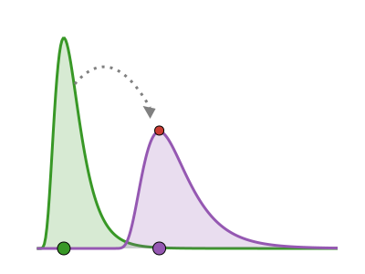

# ModifiedDistributions 

<!-- badges:start -->
| **Documentation** | **Build Status** | **Code Quality** | **License & DOI** | **Downloads** |
|:-----------------:|:----------------:|:----------------:|:-----------------:|:-------------:|
| [](https://modifieddistributions.epiaware.org/stable/) [](https://modifieddistributions.epiaware.org/dev/) | [](https://github.com/EpiAware/ModifiedDistributions.jl/actions/workflows/test.yaml) [](https://codecov.io/gh/EpiAware/ModifiedDistributions.jl) [](https://github.com/EpiAware/ModifiedDistributions.jl/actions/workflows/ad.yaml) | [](https://github.com/SciML/SciMLStyle) [](https://github.com/JuliaTesting/Aqua.jl) [](https://github.com/aviatesk/JET.jl) | [](https://opensource.org/licenses/MIT) | [](https://juliapkgstats.com/pkg/ModifiedDistributions) [](https://juliapkgstats.com/pkg/ModifiedDistributions) |

| ForwardDiff | ReverseDiff (tape) | Enzyme forward | Enzyme reverse | Mooncake reverse | Mooncake forward |
|:---:|:---:|:---:|:---:|:---:|:---:|
| [](https://app.codecov.io/gh/EpiAware/ModifiedDistributions.jl?flags%5B0%5D=ad-forwarddiff) | [](https://app.codecov.io/gh/EpiAware/ModifiedDistributions.jl?flags%5B0%5D=ad-reversediff) | [](https://app.codecov.io/gh/EpiAware/ModifiedDistributions.jl?flags%5B0%5D=ad-enzyme-forward) | [](https://app.codecov.io/gh/EpiAware/ModifiedDistributions.jl?flags%5B0%5D=ad-enzyme-reverse) | [](https://app.codecov.io/gh/EpiAware/ModifiedDistributions.jl?flags%5B0%5D=ad-mooncake-reverse) | [](https://app.codecov.io/gh/EpiAware/ModifiedDistributions.jl?flags%5B0%5D=ad-mooncake-forward) |
<!-- badges:end -->

Composable unary modifiers for [Distributions.jl](https://github.com/JuliaStats/Distributions.jl) univariate distributions: affine transforms, likelihood weights, hazard modification, and forward-series transforms, plus the generic `get_dist` unwrap protocol.

## Why ModifiedDistributions?

- **Affine transforms**: `affine(dist; scale, shift)` gives the exact change-of-variables distribution of `Y = scale * X + shift`, supporting the full distribution interface (`logpdf`, `cdf`, `quantile`, sampling, and summary statistics).
- **Likelihood weights**: `weight(dist, w)` scales `logpdf` by a weight — ideal for aggregated or count observations — with vectorised `Product` forms and observation-time weights via `(value = x, weight = w)` named tuples.
- **Hazard modification**: `modify(dist, effect)` transforms a distribution's hazard function through a link — proportional hazards by default, additive hazards via `link = identity` — in closed form.
- **Forward-series transforms**: `thin(dist, p)`, `cumulative(dist)`, and the generic `transform(dist, f)` carry deterministic operations for a downstream count series while staying transparent to `logpdf`.
- **Generic unwrap protocol**: `get_dist` and `get_dist_recursive` extract the underlying distribution from any wrapper, and downstream packages can extend them for their own wrappers.
- **AD-friendly**: tested in CI against ForwardDiff, ReverseDiff, Enzyme, and Mooncake.

## Getting started

See [documentation](https://modifieddistributions.epiaware.org/stable/) for a full walkthrough.

```julia
using ModifiedDistributions, Distributions

# An affine transform Y = 2X + 1 of a LogNormal.
d = affine(LogNormal(1.5, 0.5); scale = 2.0, shift = 1.0)
logpdf(d, 5.0)

# Weight the log-likelihood contribution of an observation seen 10 times.
wd = weight(d, 10.0)
logpdf(wd, 5.0) ≈ 10.0 * logpdf(d, 5.0)

# Halve the hazard of a delay distribution (proportional hazards).
md = modify(LogNormal(1.5, 0.5), -log(2.0))
ccdf(md, 2.0) ≈ ccdf(LogNormal(1.5, 0.5), 2.0)^0.5

# Unwrap back to the inner distribution.
get_dist(wd) === d
```

## Relationship to Distributions.jl

Distributions.jl already supports affine arithmetic on some distributions (`2.0 * X + 1.0`) by returning a new parameterisation where one exists.
`affine` instead wraps any univariate distribution with the exact change-of-variables maths, so it works uniformly and keeps the inner distribution recoverable via `get_dist`.
Likewise `weight` replaces ad hoc `n * logpdf(d, x)` terms in model code with a distribution object that carries its weight, and `modify` gives hazard-scale transforms that have no Distributions.jl counterpart.

## What packages work well with ModifiedDistributions.jl?

- [Distributions.jl](https://github.com/JuliaStats/Distributions.jl) supplies the distributions being modified.
- [Turing.jl](https://github.com/TuringLang/Turing.jl) and other PPLs consume the wrappers directly, e.g. weighted likelihoods for aggregated data.
- [ComposedDistributions.jl](https://github.com/EpiAware/ComposedDistributions.jl) composes distributions into chains; a package extension lets the modifier verbs apply across a chain's observed total.
- [CensoredDistributions.jl](https://github.com/EpiAware/CensoredDistributions.jl) and the wider [EpiAware](https://github.com/EpiAware) ecosystem build censoring, convolution, and composition layers on top of these modifiers.

## Where to learn more

- [GitHub Discussions](https://github.com/EpiAware/ModifiedDistributions.jl/discussions)
- [GitHub Repository](https://github.com/EpiAware/ModifiedDistributions.jl)

## Contributing

We welcome contributions and new contributors! This package follows [ColPrac](https://github.com/SciML/ColPrac) and the [SciML style](https://github.com/SciML/SciMLStyle).

## Supporting and citing

If you would like to support ModifiedDistributions, please star the repository — such metrics help secure future funding.

If you use ModifiedDistributions in your work, please cite it (the DOI is a placeholder until the first Zenodo release):

```bibtex
@software{ModifiedDistributions_jl,
  author       = {Sam Abbott and EpiAware contributors},
  title        = {ModifiedDistributions.jl},
  year         = {2026},
  doi          = {10.5281/zenodo.XXXXXXX},
  url          = {https://github.com/EpiAware/ModifiedDistributions.jl}
}
```

## Code of conduct

Please note that the ModifiedDistributions project is released with a [Contributor Code of Conduct](https://github.com/EpiAware/.github/blob/main/CODE_OF_CONDUCT.md). By contributing, you agree to abide by its terms.
